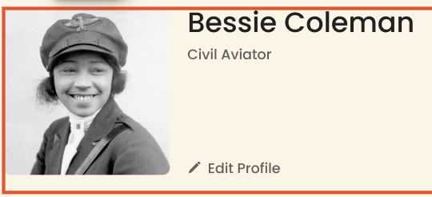

# Project 3: Spots

### Description

Spots! A social media platform where you can interact and connect with yourself and other people by creating a profile that represents your creativity and free expression. 

View profiles, like photos, edit your own profile by adding new photos and descriptions. This social media website is responsive through desktops, tablets and mobile devices. 
  
### Technologies 

- Html
- Css
- Responsive and interactive design 
- Grid and Flex displays 

### Images

Mobile design using responsive elements:

Interactive designs using hover states:

Desktop version:

Add desciptions to your profile without effecting the integrity of the layout:

 The use of **forms** in this design is for users to submit information to be able to edit their profiles: 

Add pictures and desciptions to your profile: 

### Deployment 

This webpage is deployed to GitHub Pages

- Deployment link: 
